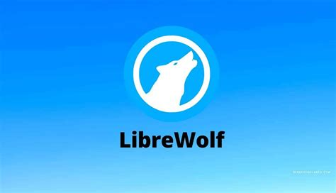

<a></a>

# 🧱 Mozilla™ Privacy Hardening Client


### ⁜Action Ⅰ : initialize your browser [Firefox, Librewolf,Waterfox]

### ⁜Action ⅠⅠ : type `about:config` on your search engine 

### ⁜Action ⅡⅠ : Accept any constrains

### ⁜Action Ⅳ : Alter these from their parent values ↴ 

## ⚙️ about:config Settings

| **Setting** | **Value** | **Purpose** |
|--------------|------------|-------------|
| privacy.resistFingerprinting | true | Masks window size, user agent, timezone, fonts, etc. |
| privacy.resistFingerprinting.letterboxing | true | Adds gray borders to normalize window dimensions. |
| privacy.trackingprotection.enabled | true | Enables built-in tracking protection. |
| privacy.firstparty.isolate | true | Isolates cookies, cache, and storage per domain (like Tor). |
| privacy.partition.network_state | true | Prevents shared connections across sites. |
| privacy.clearOnShutdown.cookies | true | Clears cookies on exit. |
| network.cookie.cookieBehavior | 1 | Blocks third-party cookies. |
| dom.event.clipboardevents.enabled | false | Prevents sites from detecting clipboard actions. |
| dom.gamepad.enabled | false | Blocks gamepad APIs used in fingerprinting. |
| dom.webaudio.enabled | false | Blocks WebAudio fingerprinting. |
| webgl.disabled | true | Blocks WebGL entirely. |
| canvas.poisondata | true | Adds noise to canvas fingerprinting. |
| geo.enabled | false | Disables geolocation. |
| media.peerconnection.enabled | false | Disables WebRTC (IP leak prevention). |
| dom.battery.enabled | false | Blocks battery API leaks. |
| dom.telephony.enabled | false | Stops mobile number API access. |
| dom.push.enabled | false | Blocks push notifications. |
| browser.safebrowsing.malware.enabled | false | Avoids Google connections. |
| browser.safebrowsing.downloads.enabled | false | Same reason — no Google download pings. |
| network.http.referer.XOriginPolicy | 2 | Blocks cross-site referrers. |
| network.http.referer.trimmingPolicy | 2 | Trims referrer info. |
| network.IDN_show_punycode | true | Prevents homograph phishing (fake domains). |
| gfx.downloadable_fonts.enabled | false | Blocks font fingerprinting. |
| layout.css.font-visibility.private | 1 | Restricts font visibility to standard fonts only. |
| dom.indexedDB.enabled | false | Disables IndexedDB (prevents supercookies). |
| dom.storage.enabled | false | Disables local/session storage. |
| dom.maxHardwareConcurrency | 2 | Masks CPU core count. |
| network.cookie.lifetimePolicy | 2 | Deletes cookies after session ends. |

---

## 🧩 Recommended Extensions

| **Extension** | **Purpose** | **Settings to Tweak** |
|----------------|-------------|------------------------|
| **uBlock Origin** | Blocks trackers, ads, cryptominers. | Add extra filter lists: *EasyPrivacy*, *Peter Lowe’s*, *Fanboy’s Enhanced Tracking*. |
| **CanvasBlocker** | Masks canvas, audio, and DOM fingerprinting. | Mode: *Block everything*; enable noise randomization. |
| **NoScript** | Blocks all JavaScript by default. | Allow scripts only for sites you explicitly trust. |
| **Decentraleyes** | Replaces CDN requests with local resources. | Auto mode: *Enabled*. |
| **Temporary Containers** | Auto-isolates every tab in its own container (like Tor). | Set to auto-delete containers on close. |

---

<a></a>
<p align="center">
  
  
   
</p>
<a></a>
<p align="center">
🙶 They build systems to watch men i build walls they never climb 🙸
</p>
<p align="center">
   ~ Thomas Shelby
</p>
<a></a>

## 🌐 Route All [Firefox, Librewolf, Waterfox] Through Tor
⧉Red Hat Enteprise Linux :
```bash
sudo dnf install tor
sudo systemctl start tor
```
---

⧉Debian : 
```bash
sudo apt install tor
sudo systemctl start tor
```
---

⧉Arch : 
```bash
sudo pacman install tor
sudo systemctl start tor
```
---

⧉Windows :

☑ Download Tor from > https://www.torproject.org/download/tor/

☑ Download the 'Window Expert Bundle' zip file

☑ Extract and run the following in CMD : 
```shell
C:\Tor
cd C:\Tor
tor.exe
start /min tor.exe
```
---

### Then in [Librewolf, Firefox or Waterfox] :

Settings ⮚ General ⮚ Network Settings ⮚ Manual Proxy Configuration

```
SOCKS Host: 127.0.0.1
Port: 9050
Proxy DNS when using SOCKS v5:
```
---

### god practice : 

❖ install or use the StartPage® search engine from addons of Mozilla™-It gives more privacy 🢆

https://addons.mozilla.org/en-US/firefox/addon/startpage-private-search/

<a></a>
### FAQs : How can all these tweaks be termed as functional ? 

| **Test Type** | **Tool / URL** | **Expected Result** |
|----------------|----------------|----------------------|
| Fingerprinting | [https://coveryourtracks.eff.org](https://coveryourtracks.eff.org) | “Your browser has strong protection against tracking.” |
| Canvas / WebGL | [https://browserleaks.com/canvas](https://browserleaks.com/canvas) | “Blocked” or “Randomized” results. |
| WebRTC & DNS | [https://browserleaks.com/webrtc](https://browserleaks.com/webrtc) | No local IPs shown (only 127.0.0.1 or Tor exit IP). |
| IP & Geo Check | [https://check.torproject.org](https://check.torproject.org) | Should show Tor network IP. |
| General Privacy | [https://ipleak.net](https://ipleak.net) | No real IP, no DNS leaks. |

<a></a>
### Notes :

❖.Do not maximize the window — letterboxing preserves anonymity.

❖.Avoid installing extra extensions; each adds fingerprint surface.

❖.Use Private Browsing Mode or Firejail sandbox always.

❖.Never log into personal accounts during sensitive browsing.

❖.Restart LibreWolf often to clear session metadata.

※OUTCOME : You can comfortably surf the web without any form of Digital Footprint or monitoring

※BEST FOR : Evasion from Tutor monitoring during critical operations eg school assingments and CATs

---

<a></a>
### CASE Ⅱ : Implementing using user.js : 

↬ Type about:support in your search engine

↬ Find "Profile Folder" (a button labeled Open Folder or Open Directory).

↬ Click Open Folder — this opens the profile directory where prefs.js lives. This is where you’ll add user.js

⚠ If you want to revoke the changes delete the user.js file and restart librewolf[or Firefox / Waterfox]

⛞⛞⛞⛞⛞⛞⛞⛞⛞⛞⛞⛞⛞⛞⛞⛞⛞⛞⛞⛞⛞⛞⛞⛞⛞⛞⛞⛞⛞⛞⛞⛞⛞⛞⛞⛞⛞⛞⛞⛞⛞⛞⛞⛞⛞⛞⛞⛞⛞⛞⛞⛞⛞⛞⛞⛞⛞⛞⛞⛞⛞⛞⛞⛞⛞

<p align="center">
✪ St✩r the repository for best practices !
</p>
<p align ="center">
♕ By _____■□||🅐🅤🅡🅐__●○™___ ⌂ No licences implemented
</p>
